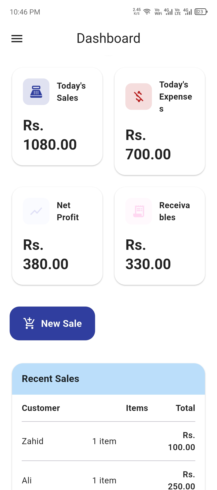
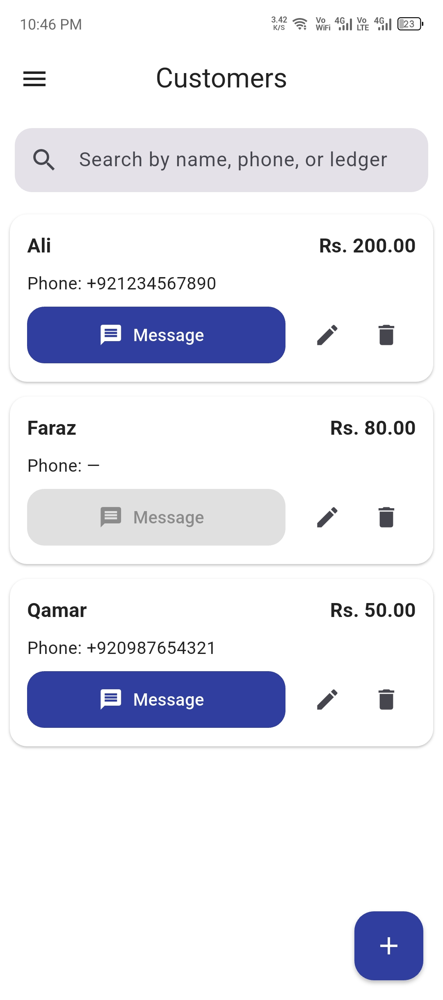
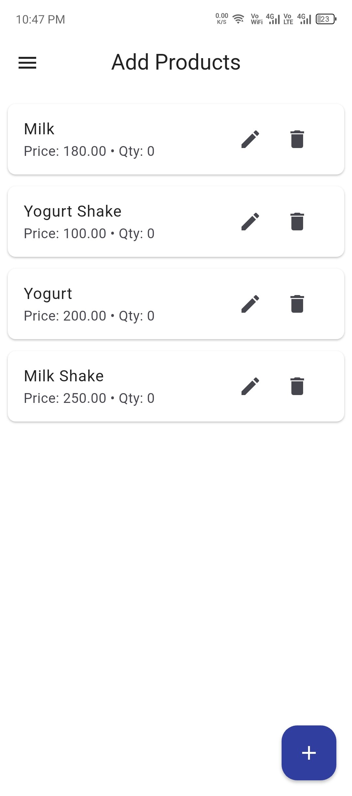
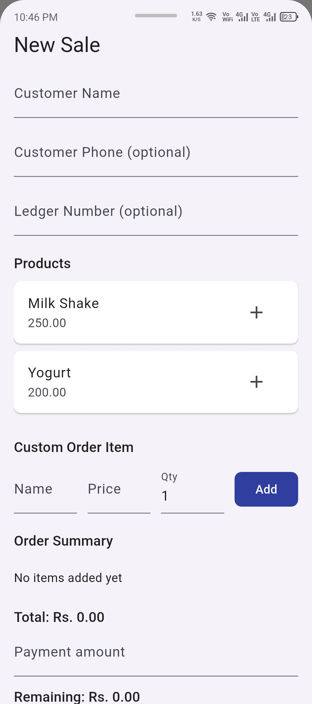
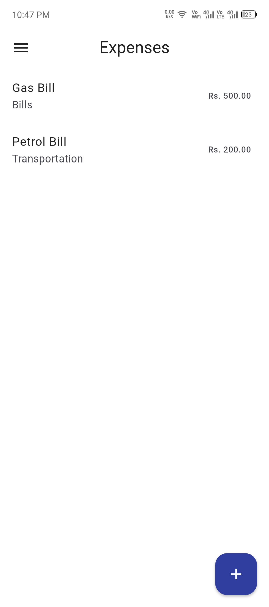
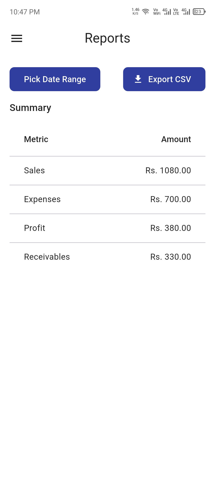

# BizTrack

A Flutter-based business management application designed to help small businesses manage customers, products, sales, receivables, expenses, and business reports from a single application.

## 📱 Overview

**BizTrack** is a practical business management app built with Flutter.

The application focuses on simplifying everyday business record management by bringing customer records, sales, receivables, expenses, products, and reports together in one place.

The project was developed with a focus on:

- Simple and practical user experience
- Organized business data management
- Mobile-first design
- Data backup and restoration
- Clean and maintainable Flutter project structure

---

## ✨ Key Features

### 👥 Customer Management

- Add and manage customers
- View customer details
- Track customer-related transactions
- Maintain customer records in an organized way

### 🛒 Product Management

- Manage products
- Maintain product information
- View products from a dedicated product section

### 💰 Sales Management

- Create and manage sales
- View sale details
- Maintain sales records
- Track sales-related information

### 📒 Receivables

- Manage customer receivables
- Record payments
- View outstanding amounts
- Track receivable payment history

### 💸 Expense Management

- Add business expenses
- View expense records
- Organize business spending information

### 📊 Reports

- View business-related reports
- Review sales and financial information
- Use organized records to understand business activity

### 💾 Backup & Restore

BizTrack includes data export/import functionality designed to help users preserve their business data.

Users can:

- Export application data
- Keep the exported backup file outside the application
- Import the backup later
- Restore previously saved business records

This is especially useful when changing devices or reinstalling the application.

### 📱 WhatsApp Support

The application includes WhatsApp-related functionality to make customer communication more convenient.

### 🎨 Theme Support

- Application theme management
- User-friendly interface
- Consistent UI across application screens

---

## 🛠️ Technology Stack

| Technology | Purpose |
|------------|---------|
| Flutter | Cross-platform application development |
| Dart | Application programming language |
| Android Studio | Android development and build environment |
| VS Code | Development and source-code editing |
| Git | Version control |
| GitHub | Source-code hosting and project portfolio |

---

## 🏗️ Project Structure

The project follows an organized Flutter structure:

```text
lib/
├── main.dart
│
├── models/
│   ├── customer.dart
│   ├── expense.dart
│   ├── product.dart
│   ├── receivable.dart
│   └── sale.dart
│
├── providers/
│   └── theme_provider.dart
│
├── screens/
│   ├── customer_detail.dart
│   ├── customer_form.dart
│   ├── customers_list.dart
│   ├── dashboard.dart
│   ├── expense_form.dart
│   ├── expenses_list.dart
│   ├── login_screen.dart
│   ├── products_list.dart
│   ├── receivable_payment.dart
│   ├── receivables_list.dart
│   ├── reports_screen.dart
│   ├── sale_detail.dart
│   ├── sale_form.dart
│   ├── sales_list.dart
│   └── settings_screen.dart
│
├── utils/
│   ├── back_handler.dart
│   ├── backup_model.dart
│   ├── export_import.dart
│   └── whatsapp_helper.dart
│
└── widgets/
    ├── app_drawer.dart
    └── pop_scope_compat.dart
```
The project structure separates models, screens, providers, utilities, and reusable widgets to make the application easier to maintain and extend.


## 📱 App Screenshots

### Dashboard
The BizTrack dashboard provides a quick overview of daily sales, expenses, net profit, receivables, and recent sales.



### Customers
Manage customers, phone numbers, ledger information, outstanding balances, and customer communication.



### Products
Manage products, prices, and available quantities from a simple product management interface.



### New Sale
Create sales by selecting customers, adding products, entering quantities, and recording payment amounts.



### Expenses
Record and manage business expenses with categories and amounts.



### Reports
View sales, expenses, profit, and receivables within a selected date range and export reports to CSV.



## 🚀 Getting Started
## Prerequisites

Before running the project, make sure you have:

Flutter SDK installed
Dart SDK
Android Studio or another Flutter-compatible development environment
Android SDK
A physical Android device or Android emulator
### Clone the repository
```bash
git clone https://github.com/tahirpkp/biztrack.git
Navigate to the project
cd biztrack
Install dependencies
flutter pub get
Run the application
flutter run

## 📦 Build APK

To create a release APK:

flutter build apk --release

The generated APK can then be found in the Flutter build output directory.

🔄 Development Workflow

The project uses Git for version control and GitHub for source-code hosting.

Typical development workflow:

Make changes
     ↓
Test the application
     ↓
git status
     ↓
git add .
     ↓
git commit
     ↓
git push
🎯 Project Goals

The main goals of BizTrack are to provide:

A simple business management experience
Organized customer and transaction records
Easy sales and receivable tracking
Expense management
Business reporting
Reliable data backup and restoration
A practical mobile solution for small businesses
🔮 Future Improvements

Potential future improvements include:

Additional business reports
Improved analytics and dashboards
Enhanced data management
More customization options
Additional platform support
Improved backup and migration capabilities
Additional productivity features based on user feedback
👨‍💻 Developer

Tahir Khan

Flutter Developer focused on building practical, user-focused mobile applications.

GitHub:

https://github.com/tahirpkp

📄 License

This project is currently maintained as a portfolio and development project.

License details may be added as the project evolves.